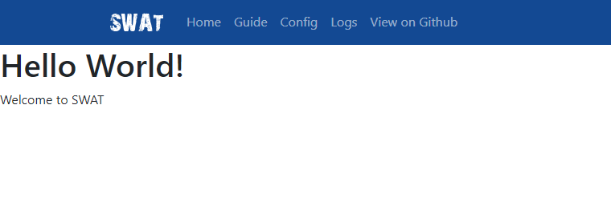

<p align="center">
    
</p>
<h3 align="center">SWAT</h3>
<hr>
<p align="center">
  <a href="../../issues">Report an Issue</a>
  ·
  <a href="../../releases">Releases</a>
  ·
  <a href="/CHANGELOG.md">Change Log</a>
</p>
<p align="center">
  <a href="#Description">Description</a>
  ·
  <a href="#Roadmap">Roadmap</a>
</p>
<hr>

## Description
A <b>S</b>imple-<b>W</b>eb-and-<b>A</b>PI-<b>T</b>emplate  

SWAT is a web template for getting simple sites up and running quickly with PHP.  

SWAT includes a log viewer, login functionality, custom 404 pages and an API suite.

## How To Use
To use SWAT download the latest [release](https://github.com/tobybutchart/SWAT/releases), and customise the following:
* 404\404_controller.php (this is your custom 404 page)
* components\header.php (the header to be displayed on all pages)
* components\footer.php (the footer to be displayed on all pages)
* login\login_controller.php (this is your custom login page - optional)
* pages\index.php (this will be your front page)

Once the above is complete, to add a new page, create a file in pages with the name of the URI you wan to point to that page.  

E.g.: create pages\hello-world.php containing the following:
```HTML
<h1>Hello World!</h1>
<p>Welcome to SWAT</p>
```  

Will produce the following from https://URL/hello-world  

  

For nested pages, add a directory that you want the URI to become (this is useful for grouping functionality).   

E.g.: a file created in: \shop\products\wood.php will create the following URI https://URL/shop/products/wood

SWAT uses [Bootstrap 5](https://getbootstrap.com/), so all valid Bootstrap classes are available.

##  Configuration
The configuration for a page is set in config\pages.ini and is used to define the functionality of each page. This is set for the whole website within the [global] section, but can be overridden on a page by page basis using the pages URI as the section header i.e. [hello-world] will override settings for the page https://URL/hello-world - any settings not overridden will be picked up by the global section.  

## Cache-breakers
Cache-breakers are included in the config file config\versions.ini and are included to all JS and CSS files. To force a browser to re-pull all cached CSS, update the version number in the CSS key.

## 404
Any URIs requested that do not exist will be routed to a custom 404 page, and will be logged. To see logs, go to logs\yyyy\mm\dd to view.

## Logging
A log viewer is available by default so issues can be looked at without server access. To view your logs navigate to https://URL/logs. This will need a login set up in config\credentials.ini.

## Login
A login system exists in SWAT for both internal users and external users. To change the login functionality alter the users API in api\users\get.php.

## APIs  
An API framework exists in SWAT and can be used in a similar way to the pages. To create a new API, add a file to the api directory, the API URI will be dictated by the file name. i.e. api\products\get.php will translate to https://URL/api/products/get.

## Extended functionality
To extend the functionality of a page/pages add a directory with the intended URI with a file inside called DIRECTORY_controller.php, i.e. \products\products_controller.php. This will override any pages with the same URI (https://URL/products), meaning all functionality is pulled from the PHP controller. See 404\404_controller.php for a working example.

## Directory Structure
Directory | Purpose |
 -------- | ------- |
 404 | Contains functionality for displaying/logging unknown requests |
 api | Contains all endpoints as flat PHP files |
 app\classes | Contains all classes used by SWAT |
 app\utilities | Contains all function oriented scripts used by SWAT
 components | Add custom components here i.e. carousel.php, banner.php, etc. |
 config | All config settings |
 defs | All define constants |
 login | Login business logic |
 logout | Logout business logic |
 logs | Contains all log files and log viewer (logs_controller.php) |
 pages | Contains all flat pages to be used within SWAT |
 temp | Contains PHP session files for SWAT |
 web | All public facing web files i.e. CSS, JavaScript, etc. |

## Roadmap
Date | Feature | Status |
:--: | ----- | ------ |
15/05/2021 | Update page_utils to use config obj | incomplete |
20/05/2021 | Include user access levels in session_utils | incomplete |
20/05/2021 | Add bootstrap feedback to login form | incomplete |
20/05/2021 | Add remember me to login | incomplete |
20/05/2021 | Set remember me time in config | incomplete |
20/05/2021 | Configurable cookie popup | incomplete |
20/05/2021 | Search function in log viewer | incomplete |
20/05/2021 | Add file modified time to log viewer | incomplete |
20/05/2021 | Add realm to config | incomplete |
20/05/2021 | Add log clean up | incomplete |
20/05/2021 | Add nested site ability | incomplete |
